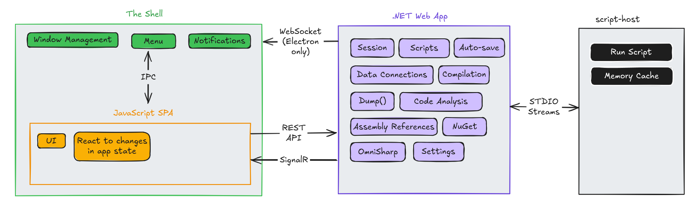

# Application Components

There are 4 major components that make up NetPad:

1. **The Shell**: Hosts the UI and mediates native-platform services. This is either Electron, Tauri, or the web
   browser.
2. **JavaScript SPA UI**: The client app written in Aurelia running inside the shell.
3. **.NET Web Application**: Core backend logic exposed over REST and SignalR.
4. **script-host**: A long-running .NET background process that communicates via STDIO.

# The Shell

The shell is the container which loads and hosts the JavaScript SPA. NetPad can run in one of 3 shells:

- **Web Browser:** NetPad can be loaded as web page into a regular web browser.
- **Electron:** NetPad can be installed and opened as an Electron desktop app.
- **Tauri:** NetPad can be installed and opened as a Tauri (Rust-native) desktop app.

#### Responsibilities

- Loads `index.html` (SPA bundle) from a URL on the .NET web app.
- Exposes native-platform features like native menus, window management (create, minimize, maximize...etc.), desktop
  notifications, taskbar functions...etc.
- Starts the .NET web application since the shell is the "entry point" on desktop (Electron & Tauri only).

# JavaScript SPA UI

The SPA is written using the Aurelia framework (v2) and TypeScript.

#### Responsibilities

- Presents the user interface.
- Calls into the .NET backend via **REST APIs** and receives real-time updates via **SignalR**.
- Calls into the shell to perform native-platform functionality like opening or maximizing a window. Calls to the shell
  are framework-dependant:
    - **Electron**: `ipcRenderer` / `ipcMain`
    - **Tauri**: Built-in Rust → JS bridge
    - **Web browser**: JavaScript APIs where available

# .NET Web Application

This is the heart of the NetPad application and where most of the real work happens. Built on ASP.NET Core, it exposes
REST endpoints and a SignalR hub for two-way communication with the SPA.

#### Responsibilities (non-exhaustive)

- **Session management**: The session is fully managed on the backend. Session state changes are pushed to SPA via
  SignalR.
- **Data Connections**: persists and scaffolds data connections and generates needed assemblies, code, and database
  structure.
- **Compilation**: Parses and compiles user code into runnable assemblies.
- **Scripts**: persists scripts, their configuration and keeps track of their state.
- **Code Analysis**: Parses user code and generates syntax trees.
- **Dump()**: provides the functionality of the `Dump()` method and serializes objects and values to HTML to render in
  the Output pane.
- **NuGet**: implements the NuGet repository integration (search, download, dependency trees...etc.).
- **Assembly References**: resolves referenced assemblies and NuGet package assets.
- **Settings**: persists and manages user settings.
- **OmniSharp**: Starts and stops OmniSharp and provides language service APIs to SPA.
- **Auto-save**: saves unsaved script changes so they're there the next time you start NetPad.
- **script-host**: Manages the lifetime of the `script-host` background process and interfaces with it via STDIO.

# script-host

A long-running background process built in .NET that exposes a simple STDIN/STDOUT-based protocol. A `script-host`
instance is started for each script the user runs.

#### Responsibilities

- Runs a compiled user script assembly and sends output back to the .NET web app.
- Asks .NET web app for user input when user code prompts for it.
- Maintains a memory cache of data cached by the user.

# Others

OmniSharp is downloaded as a pre-compiled binary and runs as a separate process. NetPad starts, stops and communicates
with the OmniSharp process via STDIO.