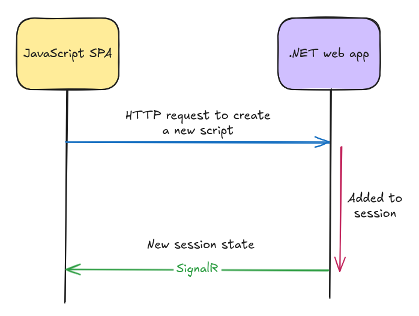
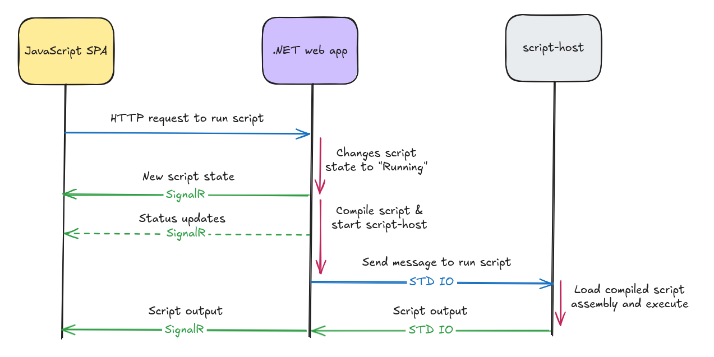

# Inter-Process Communication (IPC)

Typically, one of the most complicated parts of a multiprocess application is how all its components talk to one
another. This is an attempt at outlining how it happens in NetPad.

## .NET Web App `<->` SPA

- Most calls **from SPA to .NET app** is made via HTTP REST API requests.
    - Examples:
        - Open, close, save, rename script.
        - Run a script.
        - Open windows (Settings, Properties...etc.)
        - Edit script (code changes, change script SDK, change target data connection...etc.)
        - Create, edit, delete data connection.
- Very few calls are made **from SPA to .NET app** via SignalR.
    - Examples:
        - Select a tab (changing the active script)
        - Response to a request made from .NET to SPA via SignalR.
- All calls **from .NET app to SPA** are made via SignalR.
    - Examples:
        - State changes (session changes, script property changes, app status messages...etc.)
        - Ask user for input (due to user code requesting it)
        - Rendering script output.

In general, all non-trivial state is maintained in the .NET web app. This includes:

- Which scripts are open.
- Which script is the active script (selected tab).
- Which script was the last active script (the previously selected tab).
- The current state of each script (code, kind, target SDK, target connection, whether it has unsaved changes...etc.).
- Which scripts are running or have errored during execution...etc.
- Whether a data connection has been scaffolded or not.
- If OmniSharp is running or not.

Some state changes are pushed to the SPA frontend and in some cases, the SPA will maintain its own copy of that state
and updates it as it receives notifications from the .NET web app. You can find which state changes are pushed to SPA in
`EventForwardToIpcBackgroundService.cs`.

> The idea is to keep all important state on the backend, for 2 reasons:
> 1. If the UI/Shell is swapped out for something else (an Avalonia desktop app for example), all the state management
     is untouched and can be integrated with via REST APIs and SignalR notifications.
> 2. This enables the ability to have multiple people collaborate within the same NetPad session; similar to Visual
     Studio Live-Share, or JetBrains Code With Me.

## .NET Web App `<->` script-host

All communication between the .NET web app and the `script-host` process occurs via STDIN/STDOUT streams. Data is sent
in known message formats that both applications understand and expect.

## Examples

### User starts a new script (new tab)

### User runs a script

