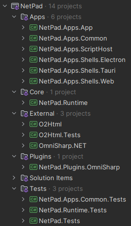

# Solution Structure

## Overview

The NetPad solution is composed of the following projects:



### Summary 

```
└── Apps/                           # Executable applications, UI shells, and infrastructure
  ├── NetPad.Apps.App               # Main executable: .NET backend + JavaScript SPA
  ├── NetPad.Apps.Common            # Orchestration + infrastructure
  ├── NetPad.Apps.ScriptHost        # Long running executable responsible for running script
  ├── NetPad.Apps.Shells.Electron   # Electron UI shell
  ├── NetPad.Apps.Shells.Tauri      # Tauri (Rust) UI shell
  ├── NetPad.Apps.Shells.Web        # Web (browser) UI shell

└── Core/
  └── NetPad.Runtime                # Core abstractions and runtime logic

└── External/                       # Utility libraries that will eventually be split into their own NuGet packages
  ├── O2Html                        # Provides object-to-HTML conversion + HTML DOM
  ├── O2Html.Tests                  # Test project for O2Html
  └── OmniSharp.NET                 # Integration wrapper to interface with OmniSharp process

└── Plugins/                        # Built-in NetPad plugins
  └── NetPad.Plugins.OmniSharp      # Plugin for OmniSharp-based language features (e.g., code completion, diagnostics)

└── Solution Items/                 # General solution files (e.g., .editorconfig, README.md, global.json, etc.)

└── Tests/                          # Solution-wide test projects
  ├── NetPad.Apps.Common.Tests      # Test project for NetPad.Apps.Common
  ├── NetPad.Runtime.Tests          # Test project for NetPad.Runtime
  └── NetPad.Tests                  # Shared test code for use in other test projects
```

## Projects

### Apps/`NetPad.Apps.App`

🟢 `Executable`

This is the "main" executable/app that runs when NetPad is started. It includes two components:

1. The ASP.NET API web app (backend)
2. The JavaScript SPA (UI/frontend) written in Aurelia 2 and TypeScript and is served by the ASP.NET web app

NetPad can be packaged and run in 3 different "formats":

- **Web Browser:** The ASP.NET web app runs and can be navigated to from a regular web browser.
- **Electron:** NetPad can be packaged as an Electron desktop app.
- **Tauri:** NetPad can be packaged as a [Tauri](https://v2.tauri.app/) (Rust-based) desktop app.

Each of the 3 previous formats is referred to as a "shell". A shell is just the method in which users access and
interface with NetPad's user interface:

- **Web Browser Shell:** The UI is loaded in the user's web browser
- **Electron Shell:** When the Electron desktop app runs, it loads the JS app from the ASP.NET web app into an Electron
  window.
- **Tauri:** When the Tauri desktop app runs, it loads the JS app from the ASP.NET web app into a WebView window.

#### Shell Implementations

Some features require NetPad components to interface with the shell (ex. windowing features, native dialogs). Since
every shell works differently, these interactions are abstracted in code. Each shell will have its own implementation of
these abstractions. For example, the way a window is opened in Electron is different that how a window is opened in
Tauri. The app uses an abstraction (interface) to call into opening a window, then depending on the currently running
shell, the corresponding implementation is invoked.

When the .NET web app starts, an argument is supplied to tell it which shell implementation should be loaded and used.
Each shell implementation is in a separate assembly in the `Apps` solution folder, named `NetPad.Apps.Shells.*`.

### Apps/`NetPad.Apps.Shells.Web`

The implementation for the web (browser) shell. Used when NetPad runs as a web application, instead of a desktop app.

### Apps/`NetPad.Apps.Shells.Electron`

The implementation for the Electron shell. Used when NetPad runs as an Electron desktop app. An integral part of this
implementation is the ElectronSharp library, which enables calling into Electron from .NET code.

### Apps/`NetPad.Apps.Shells.Tauri`

The implementation for the Tauri shell. Used when NetPad runs as a Tauri desktop app. Tauri is a Rust framework that
opens a window that contains a WebView which in turn loads a web page, in this case the NetPad JS app.

> :bulb:
> The Tauri shell is a native application which has the following advantages over the Electron shell:
> 1. Faster to start.
> 2. Uses significantly less system resources at runtime.
> 3. Smaller installer and takes up less disk space when installed.
>
> Note that **only** the shell is native; it still loads a web-based user interface within it.

### Apps/`NetPad.Apps.ScriptHost`

🟢 `Executable`

This executable is a long-running process that is started and managed by the .NET app as part of its
`ClientServerExecutionModel`. It is not meant to be started manually by users. This process is used to:

1. Run compiled user code.
2. Stay alive so that consecutive script executions are fast.
3. Cache in-memory data that can be accessed by a script across multiple script executions.

A separate `script-host` process is started for each individual script.

### Apps/`NetPad.Apps.Shells.Common`

This library contains:

- Abstractions for the .NET app to interface with the different UI shells.
- An orchestration layer (commands & queries) that are called by controller actions from the ASP.NET web app.
- Infrastructure implementations.
- Implementation for EF core data connections

### Core/`NetPad.Runtime`

This is the main core library that contains most of NetPad's functionality. It contains (non-exhaustive):

- Abstractions
- Parsing & compiling user code
- Script execution models
- Session management
- Data connections
- User settings
- IO handling

### `External`

This solution folder contains projects that extend NetPad by filling gaps where third-party libraries were unavailable
or unwieldy. Each library is designed as a standalone component and is intended for separate release as a NuGet package.

### External/`O2Html`

A fast HTML serializer for .NET objects and values. It is used to:

1. Converts `Dump()` output into HTML for display in the output pane.
2. Provides a compact HTML DOM API for building interactive UIs in scripts—and rendering them via `Dump()`.

### External/`OmniSharp.NET`

This library is used to start and interact with an OmniSharp server instance. OmniSharp has little to no documentation
and it was a real challenge figuring out how to get it to work. It provides an easy to use interface and abstracts the
complexity of starting and interacting with OmniSharp.

This library streamlines launching and communicating with an OmniSharp server instance. With sparse documentation and an
involved startup process, integrating OmniSharp directly can be daunting. By abstracting away initialization details and
low-level protocol handling behind a clean, intuitive API, this library makes working with OmniSharp effortless.

### `Plugins`

This solution folder contains built-in plugins for NetPad. The current plugin system is quite sparse, but will be
improved and expanded to allow user-created plugins.

### Plugins/`NetPad.Plugins.OmniSharp`

A bridge between NetPad and OmniSharp. Contains:

- API controller actions for frontend to interface with OmniSharp.
- Uses `OmniSharp.NET` to start, manage and interface with a OmniSharp server instance.

This plugin has a UI component that lives in: `Apps/NetPad.Apps.App/App/src/core/@plugins/omnisharp` which registers a
number of Monaco language feature providers. The UI component calls the API controllers in the backend plugin to provide
its language features.

Developed as a standalone plugin to make it easier to swap out the language service from OmniSharp to something else
down the road.
